# 🔒 Azure Private Endpoint & Managed Identity Lab

> Secure access to Azure Storage Account using **Private Endpoint** and **Managed Identity** — eliminating public internet exposure.


---

## 📐 Architecture


**Traffic flow:**

```mermaid
graph LR
    A[🖥️ VM - 10.1.0.4] -->|1. DNS Query| B[🔍 Private DNS Zone]
    B -->|2. Resolves to 10.1.15.4| C[🔗 Private Endpoint]
    C -->|3. Private Access| D[📦 Storage Account]
    E[🌍 Internet User] -->|❌ Blocked| D
```



| Component | Name | IP / Value |
|-----------|------|------------|
| 🖥️ VM | `vm-hub` | `10.1.0.4` |
| 🔗 Private Endpoint | `stprivatelinklab01` | `10.1.15.4` |
| 📦 Storage Account | `stprivatelinklab01` | Public access **disabled** |
| 🔍 Private DNS Zone | `privatelink.blob.core.windows.net` | A record → `10.1.15.4` |
| 🆔 Managed Identity | `identity` | User-assigned |

---

## 📋 What This Lab Covers

| Concept | Description |
|---------|-------------|
| **Private Endpoint** | Assigns a private IP to a PaaS resource inside your VNet |
| **Private DNS Zone** | Resolves `*.blob.core.windows.net` to the private IP within the VNet |
| **Managed Identity** | Passwordless authentication — VM proves its identity without credentials |
| **Network + Auth Layers** | Two independent security layers working together |

---

## 📋 Prerequisites

- Azure Subscription
- Existing Hub VNet (or create a new one)
- A Linux VM inside the VNet
- SSH access to the VM

---

## 🚀 Step-by-Step Guide (Azure Portal)

### Step 1 — Create Resource Group

1. Portal → **Resource groups** → **Create**
2. Name: `rg-privatelink-lab`
3. Region: `East US 2`
4. **Review + Create** → **Create**

---

### Step 2 — Create Subnet for Private Endpoint

> If you already have a Hub VNet, add a new subnet to it.

1. Portal → **Virtual Networks** → select your Hub VNet
2. **Subnets** → **+ Subnet**
3. Name: `snet-privateendpoint`
4. Address range: `10.1.18.0/24`
5. **Save**

---

### Step 3 — Create Storage Account

1. Portal → **Storage accounts** → **Create**
2. **Basics:**
   - Resource group: `rg-privatelink-lab`
   - Name: `stprivatelinklab01`
   - Region: `East US 2`
   - Performance: **Standard**
   - Redundancy: **LRS**
3. **Networking:**
   - Network access: **Disable public access and use private access**
4. **Review + Create** → **Create**

---

### Step 4 — Create Private Endpoint

1. Go to **stprivatelinklab01** → **Networking** → **Private endpoint connections** tab
2. Click **+ Private endpoint**
3. **Basics:**
   - Name: `stprivatelinklab01`
   - Region: `East US 2`
4. **Resource:**
   - Resource type: `Microsoft.Storage/storageAccounts`
   - Resource: `stprivatelinklab01`
   - Target sub-resource: **blob**
5. **Virtual Network:**
   - Virtual network: your Hub VNet
   - Subnet: `snet-privateendpoint`
6. **DNS:**
   - Integrate with private DNS zone: **Yes**
   - ✅ This automatically creates the DNS zone, VNet link, and A record
7. **Review + Create** → **Create**

---

### Step 5 — Create Managed Identity

1. Portal → search **Managed Identities** → **Create**
2. Resource group: `rg-privatelink-lab`
3. Name: `identity`
4. Region: `East US 2`
5. **Review + Create** → **Create**

---

### Step 6 — Assign Managed Identity to VM

1. Portal → **Virtual Machines** → **vm-hub**
2. **Identity** → **User assigned** tab → **Add**
3. Select `identity` → **Add**

---

### Step 7 — Grant Storage RBAC Role

1. Portal → **Storage accounts** → **stprivatelinklab01**
2. **Access Control (IAM)** → **+ Add** → **Add role assignment**
3. Role: **Storage Blob Data Reader** → **Next**
4. Assign access to: **Managed identity**
5. **+ Select members** → select `identity`
6. **Review + assign**

---

### Step 8 — Upload Test Data

Since public access is disabled, upload from the VM:

```bash
# Install Azure CLI
curl -sL https://aka.ms/InstallAzureCLIDeb | sudo bash

# Login with managed identity
az login --identity

# Create container and upload file
az storage container create --name data --account-name stprivatelinklab01 --auth-mode login

echo "Hello from Private Link Lab" > log.txt

az storage blob upload --container-name data --file hello.txt --name hello.txt --account-name stprivatelinklab01 --auth-mode login
```

> 💡 **Alternative:** Temporarily enable public access in Storage Networking, upload via Portal, then disable it again.

---

## ✅ Verification

### Test 1 — DNS Resolution

**From VM (inside VNet) — should return private IP:**

```
$ nslookup stprivatelinklab01.blob.core.windows.net

Non-authoritative answer:
stprivatelinklab01.blob.core.windows.net  canonical name = stprivatelinklab01.privatelink.blob.core.windows.net.
Name:   stprivatelinklab01.privatelink.blob.core.windows.net
Address: 10.1.15.4    ✅ Private IP
```

**From local machine (outside VNet) — should return public IP:**

```
$ nslookup stprivatelinklab01.blob.core.windows.net

Non-authoritative answer:
stprivatelinklab01.blob.core.windows.net  canonical name = stprivatelinklab01.privatelink.blob.core.windows.net.
Name:   blob.lvl08prdstr12a.store.core.windows.net
Address: 20.209.179.2    ❌ Public IP — access denied
```

---

### Test 2 — Data Access with Managed Identity (No Azure CLI Needed)

**From VM — get token via IMDS and access blob:**

```bash
# Get access token from Instance Metadata Service (IMDS)
TOKEN=$(curl -s 'http://169.254.169.254/metadata/identity/oauth2/token?api-version=2018-02-01&resource=https://storage.azure.com/' -H Metadata:true | python3 -c "import sys,json;print(json.load(sys.stdin)['access_token'])")

# Access blob using the token
curl -s -H "Authorization: Bearer $TOKEN" -H "x-ms-version: 2020-10-02" "https://stprivatelinklab01.blob.core.windows.net/data/log.txt"
```

```
Hello from Private Link Lab    ✅ File content returned successfully
```

**From local machine — access denied:**

```
$ curl "https://stprivatelinklab01.blob.core.windows.net/data/log.txt"

<Error>
  <Code>PublicAccessNotPermitted</Code>    ❌ Blocked — public access disabled
</Error>
```

---

## 🔐 How It Works

### Two Security Layers

```mermaid
graph LR
    subgraph Layer 1 - NETWORK
        PE[🔗 Private Endpoint]
    end
    subgraph Layer 2 - AUTH
        MI[🆔 Managed Identity Token]
    end
    VM[🖥️ VM] --> PE --> MI --> ST[📦 Storage]
```



| Layer | Purpose | How |
|-------|---------|-----|
| **Network** | Controls *where* traffic comes from | Private Endpoint allows only VNet traffic |
| **Authentication** | Controls *who* is accessing | Managed Identity provides auto-rotating token |

### IMDS (Instance Metadata Service)

| Property | Value |
|----------|-------|
| Address | `http://169.254.169.254` |
| Accessibility | Only from within the VM |
| Token lifetime | ~1 hour (auto-renewed by SDKs) |
| Credentials needed | None — identity is tied to the VM |

---

## 🏢 Real-World Application

In production, this pattern secures access to:

| Service | Sub-resource | DNS Zone |
|---------|-------------|----------|
| Storage Account | `blob`, `file`, `table`, `queue` | `privatelink.blob.core.windows.net` |
| Azure SQL | `sqlServer` | `privatelink.database.windows.net` |
| Key Vault | `vault` | `privatelink.vaultcore.azure.net` |
| Cosmos DB | `sql` | `privatelink.documents.azure.com` |
| App Service | `sites` | `privatelink.azurewebsites.net` |

### Hub-Spoke Architecture

```mermaid
graph TB
    subgraph Hub VNet
        PE[🔗 Private Endpoints]
        FW[🔥 Azure Firewall]
        GW[🌐 VPN Gateway]
        DNS[🔍 Private DNS Zones]
    end

    subgraph Spoke 1
        AKS[☸️ AKS Cluster]
    end

    subgraph Spoke 2
        APP[📱 App Service]
    end

    AKS -->|Peering| PE
    APP -->|Peering| PE
    PE --> Storage[(📦 Storage)]
    PE --> SQL[(🗄️ SQL DB)]
    PE --> KV[(🔑 Key Vault)]
```



> ⚠️ For spoke VNets, link the Private DNS Zone to each spoke VNet for proper resolution.

---


| Topic | Detail |
|-------|--------|
| Private Endpoint vs Service Endpoint | PE assigns private IP inside VNet; SE routes over Azure backbone but keeps public IP |
| DNS is critical | Without `privatelink.*` zone, resolution falls back to public IP |
| NSG support | NSGs on Private Endpoint subnets are now supported |
| Sub-resource types | `blob`, `file`, `table`, `queue`, `web`, `dfs` |
| Managed Identity | Preferred auth method — no credential management |
| Manual approval | Cross-tenant PE connections can require manual approval |

---

## 🧹 Cleanup

```bash
az group delete --name rg-privatelink-lab --yes --no-wait
```

Or via Portal: **Resource groups** → `rg-privatelink-lab` → **Delete resource group**

---

## 🛠️ Technologies Used


---


📄 License
This project is licensed under the MIT License.
